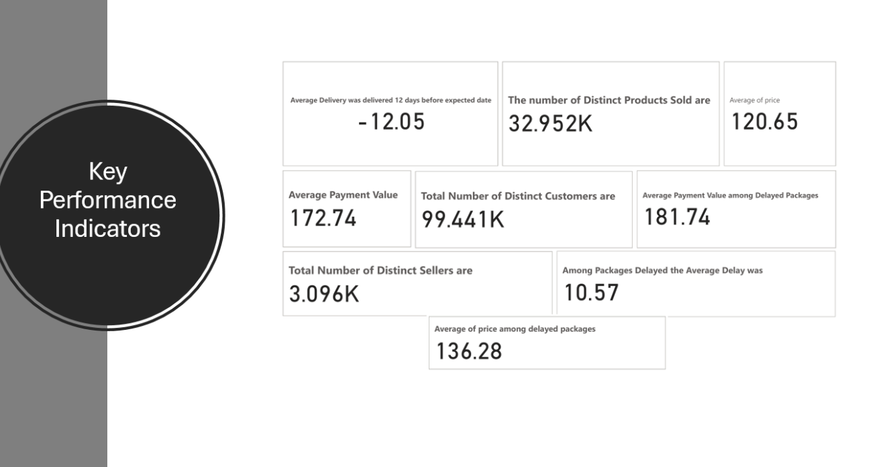

# 💡 Azure Data Engineering Project – Olist E-Commerce Dataset

## 📌 Overview

This project showcases a comprehensive **end-to-end big data pipeline** using **Microsoft Azure** to ingest, transform, enrich, and visualize large-scale e-commerce data from the Brazilian Olist marketplace. It integrates structured and unstructured data from **GitHub**, **MySQL**, and **MongoDB**, and leverages **Azure Data Factory**, **Databricks (PySpark)**, **ADLS Gen2**, **Synapse Analytics**, and **Power BI** to derive business insights and drive data-driven decisions.

---

## 🚀 Architecture

The architecture follows the modern **Data Lakehouse** paradigm:

- **Data Sources**: GitHub (CSV), MySQL (relational), MongoDB (NoSQL)
- **Ingestion**: Azure Data Factory using parameterized JSON pipelines
- **Storage**: ADLS Gen2 with Delta Lake architecture (Bronze → Silver → Gold)
- **Transformation**: PySpark transformations on Azure Databricks
- **Enrichment**: MongoDB tables joined during data processing
- **Serving & Visualization**: Synapse SQL views connected to Power BI dashboards

---

## 📂 Data Sources

The dataset used is the **Olist E-commerce Dataset**, which includes:

- Customers  
- Orders  
- Sellers  
- Payments  
- Products  
- Reviews  
- Geolocation  

This data is rich in transactional and behavioral information, ideal for generating actionable insights.

---

## 📊 Exploratory Data Analysis (EDA)

Key metrics and KPIs were analyzed using **PySpark** and visualized with **Power BI**, including:

- Average Delivery Delay  
- Top Product Categories by Revenue  
- Freight vs Payment Value Trends  
- Customer Engagement by Region  
- Pearson Correlation Matrix  
- Delivery Timeliness by State  

---

## 📈 Power BI Dashboard Highlights

- Order trends over time and across regions  
- Freight cost distribution and payment behavior  
- KPI tiles (delay, payment value, top-selling products)  
- Top sellers and categories performance  
- Estimated vs actual delivery times  

---

## 🔐 Tech Stack

- **Azure Data Factory** – for orchestrated data ingestion  
- **Azure Databricks (PySpark)** – for scalable data transformation  
- **Azure Data Lake Gen2** – hierarchical big data storage  
- **Azure Synapse Analytics** – for serving transformed data  
- **Power BI** – for rich visual analytics  
- **MySQL** – structured data source (via Files.io)  
- **MongoDB** – unstructured data enrichment  
- **GitHub** – version control and raw data hosting  

---

## 📌 Introduction

This project explores large-scale e-commerce operations on the Olist platform using modern Azure data engineering tools. It covers the full lifecycle from data ingestion to actionable analytics.

---

## 📦 Project Summary

- Solved logistics inefficiencies using real-world transactional data  
- Employed Azure ADF, Databricks, Synapse, and Power BI  
- Combined relational (MySQL) and NoSQL (MongoDB) data  
- Uncovered key delivery patterns, payment trends, and regional disparities  

---

## 🏗️ Architecture Overview

The pipeline was designed with the following layers:

- **Ingestion**: ADF with JSON-based lookup-copy pipelines  
- **Storage**: ADLS Gen2 with Bronze/Silver/Gold layers  
- **Transformation**: PySpark on Databricks  
- **Serving Layer**: Synapse SQL  
- **Visualization**: Power BI  

---

## 🔗 Repository and Data Sources

- GitHub for hosting CSV files  
- Files.io to load MySQL and MongoDB datasets  
- Entity-Relationship Diagrams for join logic and schema alignment  

---

## 🗂️ Data Lake Zones and Pipelines

- **Bronze Layer**: Raw data ingestion  
- **Silver Layer**: Cleaned and structured data  
- **Gold Layer**: Aggregated datasets for BI  
- Pipelines utilize Lookup → ForEach → Copy pattern with parameterization  

---

## 📊 Power BI Dashboard

- KPI summary tiles  
- Delivery time trends

- 

---

## 📈 Exploratory Data Analysis

- **Most Delayed Categories**: Fashion Clothing, Cine Photo  
- **Highest Revenue**: Bed Bath Table, Health Beauty  
- **Top Payment Method**: Credit Card (87,776 orders)  
- **High Customer States**: São Paulo (SP), Rio (RJ), Minas Gerais (MG)  
- **Top-Rated Products**: CDs/DVDs, Books  

---

## 🔬 Insights & Advanced Analytics

- Higher freight → faster delivery  
- More product images → lower delay  
- Estimated delivery is often overestimated  
- Geographic disparity in logistics efficiency  
- Expensive items → more installment payments  
- Negative delays (early delivery) are common  

---

## ✅ Results & Conclusions

- Up to **37 days early** delivery in some cases  
- Strong correlation (r = 0.74) between freight and product value  
- Identified top-selling categories and regions  
- Delivery efficiency improved from 2016 to 2018  
- **97.13% of orders** delivered successfully  
- Recommendations:  
  - Dynamic freight pricing models  
  - Improved product metadata  
  - Predictive delivery time modeling  

---

## 🔗 Resources & References

- 📘 [Azure Data Factory Documentation](https://learn.microsoft.com/en-us/azure/data-factory/introduction)  
- 🧱 [Databricks Delta Lake Architecture](https://www.databricks.com/delta)  
- 📊 [Kaggle: Olist E-commerce Dataset](https://www.kaggle.com/datasets/olistbr/brazilian-ecommerce)  
